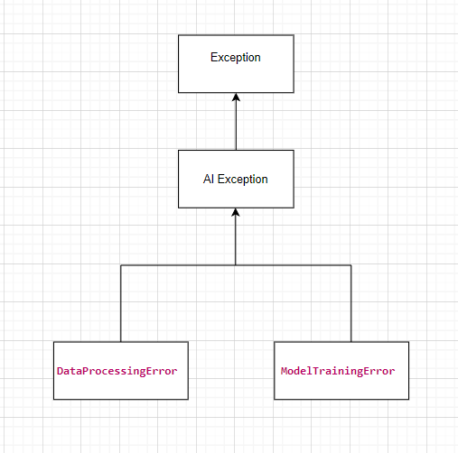

## a.) Analyze how inheritance and polymorphism are manifested in the following mock-up scenario. Focus on how the different catch blocks handle exceptions.

```java
abstract class AIException extends Exception {}
class DataProcessingError extends AIException {}
class ModelTrainingError extends AIException {}

class AIPipeline {
    void run() throws DataProcessingError, ModelTrainingError {
        if (new java.util.Random().nextBoolean())
            throw new DataProcessingError();
        else
            throw new ModelTrainingError();
    }
}

class AIPipeline2 {
    void run() throws AIException {
        if (new java.util.Random().nextBoolean())
            throw new DataProcessingError();
        else
            throw new ModelTrainingError();
    }
}

void main() {
    var pipeline1 = new AIPipeline();
    var pipeline2 = new AIPipeline2();

    try {
        pipeline1.run();
        pipeline2.run();
    }
    catch (DataProcessingError dp) {}
    catch (ModelTrainingError mt) {}
    catch (AIException ae) {}
}
```

## Answer: 
* Inheritance is expressed as the hierarchy below:




* Polymoriphism is recognized as the code below: 
  ```java
  class AIPipeline2 {
    void run() throws AIException {
        if (new java.util.Random().nextBoolean())
            throw new DataProcessingError();
        else
            throw new ModelTrainingError();
    }
    }
  ```
  and 
  ```java
  try {
    pipeline1.run();
    pipeline2.run();
    }
    catch (DataProcessingError dp) {}
    catch (ModelTrainingError mt) {}
    catch (AIException ae) {}
  ```
 * The ability to access an object (exception objects in this case: DataProcessingError, ModelTrainingError) through the type references of its superclass (AIException) is described as polymorphism in this code.


## b.)  Analyze and evaluate the following code. Think it also from the perspective of the real use-case.

## Why It Works / Does Not Work

### CurrencyConverter Class

**Works:**

- Uses a switch expression to convert amounts based on the currency.
- Handles specific currencies (EUR, GBP, JPY) and provides a default case.

**Does Not Work:**

- Returns an Object, which is not type-safe.
- May lead to casting issues and confusion.
- switch with String keys can be error-prone if not handled carefully.

### SpecificCurrencyConverter Class

**Works:**

- Attempts to override the convert method to provide a different implementation.

**Does Not Work:**

- Overridden method has a different return type (Double) compared to the original method (Object), which is not allowed in Java.
- Does not utilize the currency parameter, making it ineffective for multiple currencies.

## Advantages and Disadvantages

### CurrencyConverter Class

**Advantages:**

- Simple Implementation: Uses a straightforward switch expression.
- Flexibility: Returning Object allows different return types.

**Disadvantages:**

- Lack of Type Safety: Returning Object can lead to runtime errors.
- Limited Expandability: Adding new currencies requires modifying the switch statement.
- Default Case: Defaulting to doubling the amount may not be reasonable.

### SpecificCurrencyConverter Class

**Advantages:**

- Overriding Capability: Demonstrates method overriding.

**Disadvantages:**

- Return Type Conflict: Different return type causes compilation errors.
- Ignoring Currency Parameter: Does not utilize the currency parameter.
- Inconsistent Design: Provides a fixed conversion rate regardless of the currency.
