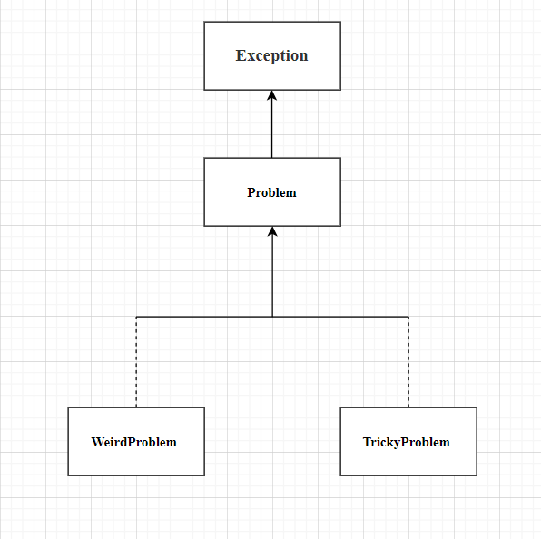

### a.) Explain how inheritance and polymorphism manifest in the following cases. Pay special attention to the different catch branches.

```java
abstract class Problem extends Exception {}
class WeirdProblem extends Problem {}
class TrickyProblem extends Problem {}

class Experiment {
    void perform() throws WeirdProblem, TrickyProblem {
        if (new java.util.Random().nextBoolean())
            throw new WeirdProblem();
        else
            throw new TrickyProblem();
    }
}

class Experiment2 {
    void perform() throws Problem {
        if (new java.util.Random().nextBoolean())
            throw new WeirdProblem();
        else
            throw new TrickyProblem();
    }
}

void main() {
    var e1 = new Experiment();
    var e2 = new Experiment2();

    try {
        e1.perform();
        e2.perform();
    }
    catch (WeirdProblem w) {}
    catch (TrickyProblem w) {}
    catch (Problem w) {}
}
```

### Answer

* **Inheritance** is represented by the ``hierarchy`` below



* **Polymorphism** is represented below:

```java
void main() {
    var e1 = new Experiment();
    var e2 = new Experiment2();

    try {
        e1.perform();
        e2.perform();
    }
    catch (WeirdProblem w) {}
    catch (TrickyProblem w) {}
    catch (Problem w) {}
}
```

* ``Experiment`` perform Method:

    * When e1.perform() is called, it can throw either a WeirdProblem or TrickyProblem.
    * If a WeirdProblem is thrown, it will be caught by the first catch block: catch (WeirdProblem w) {}.
    * If a TrickyProblem is thrown, it will be caught by the second catch block: catch (TrickyProblem w) {}.

* ``Experiment2`` perform Method:
    * When e2.perform() is called, it can also throw either a WeirdProblem or TrickyProblem, but it is declared to throw a Problem.

    * If a WeirdProblem is thrown, it will still be caught by the first catch block: catch (WeirdProblem w) {}.
    * If a TrickyProblem is thrown, it will still be caught by the second catch block: catch (TrickyProblem w) {}.
    * If for some reason, the exact type of exception thrown is not WeirdProblem or TrickyProblem but is a different subclass of Problem such as NewProblem , it would be caught by the third catch block: catch (Problem w) {}. This block will catch any exception that is an instance of Problem that wasn't caught by the previous blocks.
    * For example: 
    ``` java
        class NewProblem extends Problem {}

        class Experiment2 {
         void perform() throws Problem {
        if (new java.util.Random().nextBoolean())
            throw new WeirdProblem();
        else
            if (new java.util.Random().nextBoolean())
                throw new TrickyProblem();
            else
                throw new NewProblem();
    }
    }
    ```
    then ``NewProblem`` can be catch in (Problem w)

    ```java
    void main() {
    var e1 = new Experiment();
    var e2 = new Experiment2();

    try {
        e1.perform();
        e2.perform();
    }
    catch (WeirdProblem w) {}
    catch (TrickyProblem w) {}
    catch (Problem w) {
        // We can catch the exception object of NewProblem here. 
    }
    }
    ```

### b) Compare the following reuse methods (Printer1 and Printer2). What is each one about? How do they differ in their operating principles? How do the different methods support, for example, changing the decoration style?
The previous Printer functionality needs to be extended in the Printer3 class so that instead of the previous decoration (decorate), the decoration adds the previously defined decoration to the beginning and end of the string, along with the characters --. What kind of implementation would this be? How would your solution differ if the number of -- characters used for decoration was not 2 per side but was read from a method described in the Decorator interface? What if it was in the Printer interface?

```java
interface Decorator {
    String decorate(String input);
}

interface Printer {
    void print(String s);
    void run();
}

class Fancy implements Decorator {
    @Override
    public String decorate(String input) {
        return "== " + input + " ==";
    }
}

class Printer1 extends Fancy implements Printer {
    @Override
    public void print(String s) {
        System.out.println(s);
    }

    @Override
    public void run() {
        print(decorate("test"));
    }
}

class Printer2 implements Decorator, Printer {
    private final Decorator decorator =
            generateDecorator();

    Decorator generateDecorator() {
        return new Fancy();
    }

    @Override
    public String decorate(String input) {
        return decorator.decorate(input);
    }

    @Override
    public void print(String s) {
        System.out.println(s);
    }

    @Override
    public void run() {
        print(decorate("test"));
    }
}
```
The following code demonstrates test runs with the aforementioned classes Printer1 and Printer2, as well as the Printer3 class, which should be implemented:
 ```java
void main() {
    new Printer1().run();
    new Printer2().run();
    new Printer3().run();
}
Expected output:
== main ==
== main ==
--== main ==--
```

### Answer

``What is each one about? ``
  * The result of Printer1 and Printer2 is same (put input to decorate and print it out). They inherit (implement) both `Printer` and `Decorator`.

``How do they differ in their operating principles?``
  * Printer1: It utilizing  `Inheritance` to reuse the `decorate` by extends `Fancy`
  * Printer 2: It assigns the decoration to a `Decorator` object by using `Compostion`.
  
``How do the different methods support, for example, changing the decoration style?``
  * Printer 1: For this printer, it depends on it's superclass `Fancy`, so if you want to change something such as return another style , you will need to change  the superclass also and it's not a good idea to do that because it may effect also the order printer if they use `Fancy` as their superclass or you can override the methods of its superclass.

    For example: There have two ways to change the decoration style in this case. The first way is to change the `decorate` of `Fancy`.Other way is to override `decorate` of `Fancy`.

  * Printer 2: Not like Printer1 , it's easier to change the decoration style in it by change the delegates.

    For example: You can change the `generateDecorator` to return another `Decorator` object.

``The previous Printer functionality needs to be extended in the Printer3 class so that instead of the previous decoration (decorate), the decoration adds the previously defined decoration to the beginning and end of the string, along with the characters --. What kind of implementation would this be?``
  * I use `Inheritance` to reuse functionality and overide the method inside. For instance: 

```java
class Printer3 extends Printer1 {
    @Override
    public String decorate(String input) {
        return "--" + super.decorate(input) + "--";
    }
}
```
``How would your solution differ if the number of -- characters used for decoration was not 2 per side but was read from a method described in the Decorator interface?``

```java
interface Decrator {
    String decorate(String input);

    public int NumberofHyphen() {
        return 5 
    }
}

class Printer3 extends Printer1 {
    @Override 
    public String decorate(String input) {
        String hyphen = '-'.repeat(this.NumberofHyphen())
        return hyphen + super.decorate(input) +hyphen
    }
}
```

``What if it was in the Printer interface?``

```java
interface Printer {
    void print(String s);
    void run();
    
    default int NumberofHyphen() {
        return 5;
    }
} 

class Printer3 extends Printer1 {
    @Override
    public String decorate(String input) {
        String hyphen = '-'.repeat(this.NumberofHyphen())
        return hyphen + super.decorate(input) +hyphen
    }
}
```